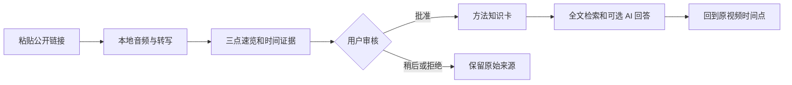
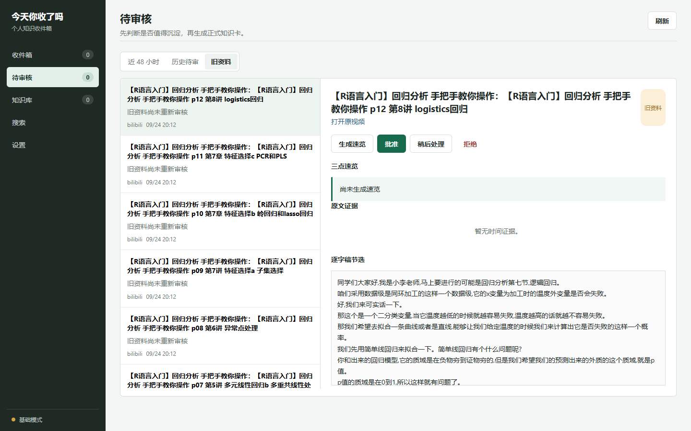
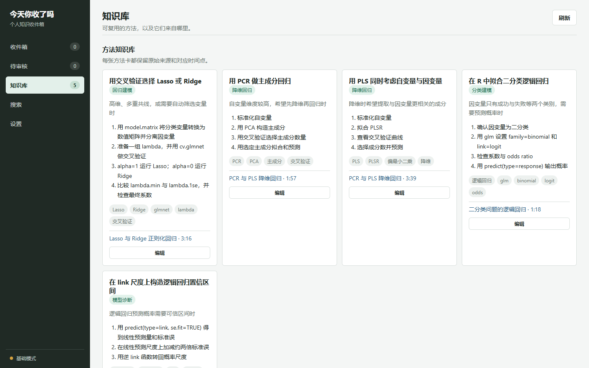
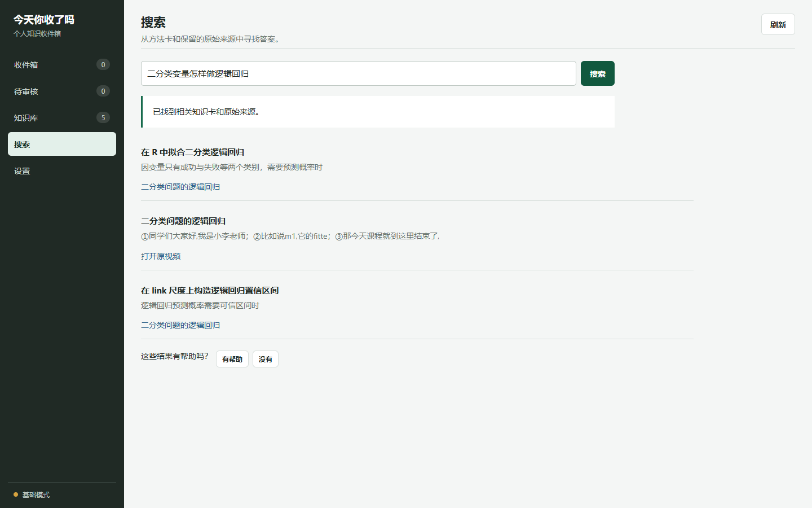

# 今天你收了吗 / Process Bilibili Course Skill

[](https://github.com/carolinozisch-web/process-bilibili-course-skill/actions/workflows/validate.yml)
[](LICENSE)

**把来不及看的收藏，变成经过审核、能追溯来源的方法库。**

> **项目状态：面试演示版（Beta）**  核心闭环已经可以在本地运行；当前仍是单用户工具，公开视频能否自动导入取决于平台的公开访问限制。后续版本会继续在同一仓库更新。

这是一个面向学习型知识工作者的本地 AI 产品，也是可安装到 Codex 的公开视频处理 Skill。它支持两条相互独立的工作流：完整课程归档，以及“导入收藏、三点速览、人工审核、方法卡、来源检索”的个人知识收件箱。

English documentation is available below.

## 功能特点

- 本地网页“今天你收了吗”，包含收件箱、近 48 小时审核、历史审核、知识库、搜索和模型设置。
- 持久化单任务队列，页面关闭后继续运行；程序重启后依据清单恢复。
- 三点速览读取完整逐字稿，基础模式与可选 AI 增强模式都有明确标记。
- 只有用户明确批准后才能生成方法卡；拒绝不会删除平台收藏或本地来源。
- 方法卡保留适用场景、步骤、限制、关键词、原视频和时间点。
- 搜索优先给出已提炼内容中的直接答案；原始视频匹配默认折叠，仅用于核对出处。
- SQLite FTS5 全文检索，并可选用兼容 Chat Completions 的模型做查询扩展和带出处回答。
- 自动识别多 P 视频，按 B 站 `page`、`cid`、标题和时长建立清单。
- 自动解析 `b23.tv` 短链接。
- 解析公开的小红书视频和 `xhslink.com` 分享短链接，也可直接接受包含链接的分享文字。
- 只保留压缩 MP3 和文字资料；成功转换后删除临时媒体流。
- 默认使用本地 `faster-whisper small`，无需 OpenAI API Key，也不消耗转写 API Token。
- 支持中英文自动识别，并允许更换 Whisper 模型、设备和计算精度。
- 每集详细笔记尽量保留原课的论点、例子、数字、因果过程和结论。
- 详细笔记标题链接到带时间戳逐字稿；仅当清单确认是多集系列时，自动加入“回到目录”和“下一篇”导航，单视频不加。
- 将“全集/合集/完整版”等疑似重复长视频标记为待确认，避免重复转写。
- 每集保存进度，电脑唤醒或 Codex 重启后可从清单断点续作。
- 自动检查缺失文件、异常短内容、残留缓存和 Markdown 失效链接。

## 产品流程



核心设计选择：转写默认在本地完成，AI 不代替用户审核，所有提炼结果必须能回到原始来源。







[查看演示验收记录](docs/demo-validation.md)

## 启动本地界面

```powershell
python process-bilibili-course/scripts/web_app.py --workspace 'D:\Video Summary'
```

Windows 也可以双击 `start-web.cmd`；需要指定其他工作目录时，把目录作为第一个参数传入。

应用只监听 `127.0.0.1`，默认打开 `http://127.0.0.1:8765`；端口被占用时会自动顺延。首次连接旧版知识库时，会先在 `知识库/backups/` 创建备份，再修正旧资料的审核状态。

可选 AI 增强支持使用 Chat Completions 协议的服务。可以在设置页临时填写，也可以使用环境变量：

```text
VIDEO_KB_LLM_BASE_URL
VIDEO_KB_LLM_MODEL
VIDEO_KB_LLM_API_KEY
```

API Key 只保存在环境变量或当前进程内存中，不会写入 SQLite、日志或导出文件。

### 3 分钟演示顺序

1. 粘贴一条公开短视频链接，并查看后台任务状态。
2. 打开已完成的三点速览和原文时间证据。
3. 批准内容，生成或人工确认一张方法卡。
4. 用自然语言搜索一个实际问题。
5. 从答案或方法卡跳回原视频对应时间点。

## 输出结构

```text
<工作目录>/
├─ 课程资料/<课程名>/
│  ├─ 00-课程入口/       # 详细目录与精炼合集
│  ├─ 01-详细笔记/
│  ├─ 02-逐字稿/
│  └─ 03-音频/           # 16 kHz、48 kbps MP3
├─ 后台处理文件/<课程名>/ # 清单、时间戳、分段与元数据
└─ 知识库/
   ├─ knowledge.db          # 审核状态、方法卡、任务和搜索反馈
   ├─ backups/              # 数据库升级前备份
   ├─ curated/              # 可读的知识卡 Markdown 导出
   └─ exports/              # 每日审核快照
```

## 安装

### 1. 准备依赖

- Python 3.10 或更高版本
- [FFmpeg](https://ffmpeg.org/download.html)，放入系统 `PATH`，或设置 `FFMPEG_PATH`
- Python 包：

```powershell
python -m pip install -r requirements.txt
```

首次转写时，`faster-whisper` 会将所选模型下载到本地缓存。

### 2. 安装 Skill

可以让 Codex 使用 `skill-installer` 从以下地址安装：

```text
https://github.com/carolinozisch-web/process-bilibili-course-skill/tree/main/process-bilibili-course
```

也可以克隆仓库后手动复制：

```powershell
git clone https://github.com/carolinozisch-web/process-bilibili-course-skill.git
$dest = Join-Path $HOME '.codex\skills\process-bilibili-course'
New-Item -ItemType Directory -Force -Path $dest | Out-Null
Copy-Item '.\process-bilibili-course-skill\process-bilibili-course\*' $dest -Recurse -Force
```

安装后重新启动 Codex，使新 Skill 出现在技能列表中。

## 使用方法

直接把 B 站或小红书链接交给 Codex，例如：

```text
使用 $process-bilibili-course 处理这个系列课程的全部分集：
https://www.bilibili.com/video/BVxxxxxxxxxx
只保留压缩音频和文字资料。
```

```text
使用 $process-bilibili-course 处理这个公开的小红书视频，生成逐字稿和详细笔记：
http://xhslink.com/o/xxxxxxxxxxx
```

Skill 会先识别平台和公开访问状态。B 站多 P 课程还会检查课程结构和疑似重复合集；小红书公开笔记按单视频处理。随后下载、转换、转写、生成详细笔记与导航，并执行完整性检查。

也可以单独运行脚本：

```powershell
python process-bilibili-course/scripts/video_pipeline.py inspect `
  --url 'https://www.bilibili.com/video/BVxxxxxxxxxx' `
  --workspace 'D:\Course Notes'

python process-bilibili-course/scripts/video_pipeline.py run `
  --url 'https://www.bilibili.com/video/BVxxxxxxxxxx' `
  --workspace 'D:\Course Notes'
```

把 `--url` 换成公开的小红书分享链接或整段分享文字，即可使用同一入口。旧的 `bilibili_pipeline.py` 命令仍作为兼容包装保留。

## 可配置项

| 参数或环境变量 | 用途 | 默认值 |
|---|---|---|
| `--workspace` / `VIDEO_SUMMARY_HOME` | 输出工作目录 | 当前目录 |
| `--ffmpeg` / `FFMPEG_PATH` | FFmpeg 可执行文件 | 从系统 `PATH` 自动查找 |
| `--model-root` / `FASTER_WHISPER_MODEL_ROOT` | 模型缓存目录 | `<工作目录>/.models/faster-whisper` |
| `--model` / `FASTER_WHISPER_MODEL` | Whisper 模型 | `small` |
| `--device` / `FASTER_WHISPER_DEVICE` | `cpu`、`cuda` 等 | `cpu` |
| `--compute-type` / `FASTER_WHISPER_COMPUTE_TYPE` | 推理精度 | `int8` |
| `--start`、`--end` | 只处理指定分集范围 | 全部 |
| `--language` | `auto`、`zh` 或 `en` | `auto` |

## 隐私与版权

- 本仓库不包含课程音频、视频、逐字稿、Cookie、API Key 或个人路径。
- 处理结果默认只保存在用户指定的本地目录，不会自动上传。
- 仅面向用户有权访问和处理的公开视频，不用于绕过登录、会员、付费、地区或 DRM 限制。
- 捆绑脚本不会提取浏览器 Cookie，也不会绕过登录、会员、付费、地区或 DRM 限制；此类内容会停止处理。
- 请遵守平台服务条款、视频作者许可和所在地法律；MIT 许可证仅覆盖本仓库的代码与文档，不覆盖下载内容。

## 当前边界

- 搜索第一阶段是 SQLite 全文检索，不宣称为向量语义检索。
- 当前知识组织仍以扁平方法卡为主，尚未表达主题层级、前置、对比和互补等知识关系。
- 不自动读取私人收藏夹，不提取浏览器 Cookie，也不执行平台侧删除。
- 当前是本地单用户产品，没有账号、云同步和多设备协作。
- AI 服务失败时会保留审核决定并退回基础模式，不会伪造方法卡。

如果这个项目对你有帮助，欢迎点一个 Star，也欢迎提交 Issue 或 Pull Request 改进跨平台支持、质量检查和笔记标准。

---

## English

This local-first product turns public Bilibili or Xiaohongshu videos into resumable course archives or a review-first personal knowledge inbox. Saved items move through local transcription, three-point triage, explicit approval, source-linked method cards, and searchable retrieval.

### Highlights

- Runs a compact local web interface bound to `127.0.0.1`.
- Keeps a durable, single-worker processing queue and resumes interrupted manifests.
- Requires explicit approval before knowledge-card creation.
- Keeps optional OpenAI-compatible credentials in memory or environment variables only.
- Returns original URLs and timestamps with retrieved knowledge.
- Inspects Bilibili metadata before downloading and orders episodes by the official page index.
- Resolves `b23.tv` short URLs automatically.
- Resolves public `xhslink.com` shares, accepts full share text, and extracts public Xiaohongshu video metadata without storing share-token queries or signed CDN URLs.
- Uses local `faster-whisper` by default; no OpenAI API key or transcription API tokens are required.
- Keeps compressed MP3 and text artifacts while removing verified temporary media streams.
- Preserves examples, numbers, reasoning, and conclusions in detailed notes instead of reducing lessons to short summaries.
- Links detailed-note headings to timestamped transcripts and adds directory/next-note navigation only for confirmed multi-episode series.
- Flags suspicious compilation episodes and abnormally short sources.
- Checkpoints after every episode and resumes interrupted runs.
- Validates expected files, manifest states, temporary media cleanup, and Markdown links.

### Quick start

1. Install Python 3.10+, FFmpeg, and `python -m pip install -r requirements.txt`.
2. Copy `process-bilibili-course/` to `~/.codex/skills/`, or ask Codex's `skill-installer` to install the repository subdirectory.
3. Restart Codex.
4. Provide a public Bilibili or Xiaohongshu URL and ask Codex to use `$process-bilibili-course`.

The CLI options and environment variables are listed in the configuration table above. Output folder names are currently Chinese so that the generated archive matches the primary workflow; file contents can be written in the user's preferred language.

### Responsible use

Use this project only for content you are authorized to access and process. It does not bypass authentication, paywalls, regional restrictions, membership controls, or DRM. Generated course materials remain local unless the user explicitly moves or publishes them.

## License

Code and documentation in this repository are released under the [MIT License](LICENSE).
