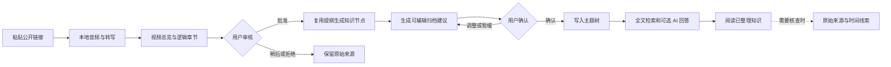
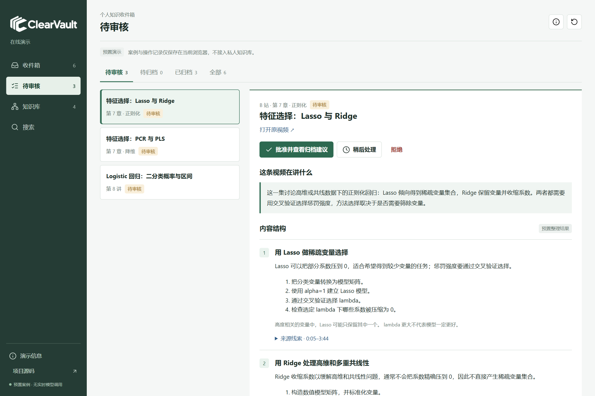
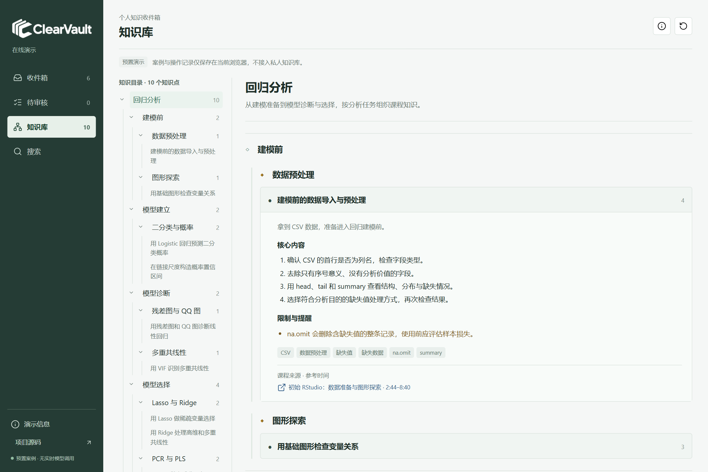
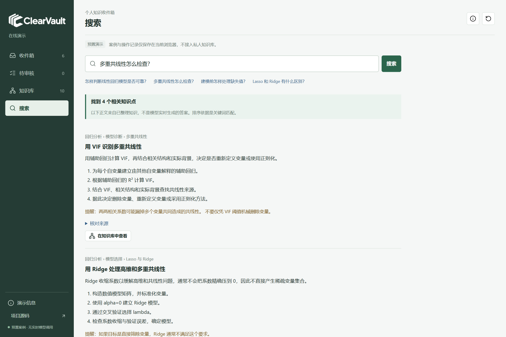

# ClearVault / Process Bilibili Course Skill

[](https://github.com/carolinozisch-web/process-bilibili-course-skill/actions/workflows/validate.yml)
[](LICENSE)

**把来不及看的收藏，变成经过审核、能追溯来源的方法库。**

> **项目状态：面试演示版（Beta）**  核心闭环已经可以在本地运行；当前仍是单用户工具，公开视频能否自动导入取决于平台的公开访问限制。后续版本会继续在同一仓库更新。

这是一个面向学习型知识工作者的本地 AI 产品，也是可安装到 Codex 的公开视频处理 Skill。它支持两条相互独立的工作流：完整课程归档，以及“导入收藏、本地转写、视频总览与逻辑章节、人工审核、知识提炼、确认归档、主题树与检索”的个人知识收件箱。原项目名为“今天你收了吗”，现统一使用 ClearVault；仓库地址与 Skill 名称保持不变，既有链接仍可使用。

## 在线体验

[打开 ClearVault 公开演示](https://clearvault-demo.carolinozisch.chatgpt.site/)，无需安装或配置 API。

在线版是**预置案例交互演示**：可审核、确认归档、展开知识和搜索；不处理新链接，也不实时调用模型。操作记录保存在当前浏览器，独立浏览器之间互不影响；同一浏览器配置共享记录，不支持账号或跨设备同步。演示不接入私人知识库。

真实链接的下载、转写和可选 AI 提炼需使用下方的本地 Beta。

English documentation is available below.

## 功能特点

- 本地网页“ClearVault”，包含收件箱、近 48 小时审核、历史审核、知识库、搜索和模型设置。
- 持久化单任务队列，页面关闭后继续运行；程序重启后依据清单恢复。
- AI 提炼读取完整逐字稿，长文本分段提取后汇总为视频总览与逻辑章节，不再强制压缩成三条零散摘要；基础模式仅提供原文线索，并明确标记。
- 只有用户明确批准后才能生成正式知识点；拒绝不会删除平台收藏或本地来源。
- 复用已审核的视频提纲生成知识节点，避免再次提交完整逐字稿；没有可用提纲时保留人工编辑路径。
- AI 可建议新建主题或归入已有主题，支持行动指南、专题档案、课程地图和资料索引；只有用户确认后才执行归档。
- 知识地图支持多层主题树与同页展开，保留原视频和时间点；人工归档可调整知识点的主要位置。
- 搜索优先给出已提炼内容中的直接答案；原始视频匹配默认折叠，仅用于核对出处。
- SQLite FTS5 全文检索；用户可另行触发兼容 Chat Completions 模型整理带出处的回答，无需预先建立固定问答库。
- 自动识别多 P 视频，按 B 站 `page`、`cid`、标题和时长建立清单。
- 自动解析 `b23.tv` 短链接。
- 解析公开的小红书视频和 `xhslink.com` 分享短链接，也可直接接受包含链接的分享文字。
- 只保留压缩 MP3 和文字资料；成功转换后删除临时媒体流。
- 默认使用本地 `faster-whisper small`，无需 OpenAI API Key，也不消耗转写 API Token。
- 支持中英文自动识别，并允许更换 Whisper 模型、设备和计算精度。
- 每集详细笔记尽量保留原课的论点、例子、数字、因果过程和结论。
- 详细笔记标题链接到带时间戳逐字稿；仅当清单确认是多集系列时，自动加入“回到目录”和“下一篇”导航，单视频不加。
- 将“全集/合集/完整版”等疑似重复长视频标记为待确认，避免重复转写。
- 每集保存进度，电脑唤醒或 Codex 重启后可从清单断点续作。
- 自动检查缺失文件、异常短内容、残留缓存和 Markdown 失效链接。

## 产品流程


```mermaid
flowchart LR
    A[粘贴公开链接] --> B[本地音频与转写]
    B --> C[视频总览与逻辑章节]
    C --> D{用户审核}
    D -->|批准| E[复用提纲生成知识节点]
    D -->|稍后或拒绝| F[保留原始来源]
    E --> I[生成可编辑归档建议]
    I --> J{用户确认}
    J -->|确认| K[写入主题树]
    J -->|调整或暂缓| I
    K --> G[全文检索和可选 AI 回答]
    G --> H[阅读已整理知识]
    H -.需要核查时.-> L[原始来源与时间线索]
```

核心设计选择：转写默认在本地完成，AI 降低理解和组织负担，用户控制正式入库。知识正文用于直接阅读，来源用于核查；时间线索仍需质量校验，见下方已知限制。

以下截图来自公开演示的预置课程案例，不代表实时模型生成。







[查看历史演示验收记录](docs/demo-validation.md)（既有固定案例，不代表当前版本的整体准确率或外部用户效果）。

## 启动本地界面

```powershell
python process-bilibili-course/scripts/web_app.py --workspace 'D:\Video Summary'
```

Windows 也可以双击 `start-web.cmd`；需要指定其他工作目录时，把目录作为第一个参数传入。

应用只监听 `127.0.0.1`，默认打开 `http://127.0.0.1:8765`；端口被占用时会自动顺延。首次连接旧版知识库时，会先在 `知识库/backups/` 创建备份，再修正旧资料的审核状态。

可选 AI 增强支持使用 Chat Completions 协议的服务。可以在设置页临时填写，也可以使用环境变量：

```text
VIDEO_KB_LLM_BASE_URL
VIDEO_KB_LLM_MODEL
VIDEO_KB_LLM_API_KEY
```

默认情况下，API Key 只保存在环境变量或当前进程内存中。在 Windows 设置页主动勾选“在这台电脑上记住 API Key”后，密钥保存到 Windows 凭据管理器；本地配置文件只保存服务地址和模型名。密钥不写入 SQLite、日志、导出文件或 Git，也不回传到网页。

### 3 分钟演示顺序

1. 粘贴一条公开短视频链接，并查看后台任务状态。
2. 打开已完成的视频总览、逻辑章节与原文依据。
3. 批准内容，生成知识节点；检查或调整归档建议，再确认写入主题树。
4. 同页展开知识，搜索一个实际问题并阅读整理结果。
5. 必要时核对来源；第三方播放器是否按时间参数跳转取决于平台，不保证跳转成功。

公开演示从第 2 步开始使用预置案例，不执行第 1 步的下载与转写。

## 输出结构

```text
<工作目录>/
├─ 课程资料/<课程名>/
│  ├─ 00-课程入口/       # 详细目录与精炼合集
│  ├─ 01-详细笔记/
│  ├─ 02-逐字稿/
│  └─ 03-音频/           # 16 kHz、48 kbps MP3
├─ 后台处理文件/<课程名>/ # 清单、时间戳、分段与元数据
└─ 知识库/
   ├─ knowledge.db          # 审核状态、知识点、主题树、任务和搜索反馈
   ├─ backups/              # 数据库升级前备份
   ├─ curated/              # 可读的知识卡 Markdown 导出
   └─ exports/              # 每日审核快照
```

## 安装

### 1. 准备依赖

- Python 3.10 或更高版本
- [FFmpeg](https://ffmpeg.org/download.html)，放入系统 `PATH`，或设置 `FFMPEG_PATH`
- Python 包：

```powershell
python -m pip install -r requirements.txt
```

首次转写时，`faster-whisper` 会将所选模型下载到本地缓存。

### 2. 安装 Skill

可以让 Codex 使用 `skill-installer` 从以下地址安装：

```text
https://github.com/carolinozisch-web/process-bilibili-course-skill/tree/main/process-bilibili-course
```

也可以克隆仓库后手动复制：

```powershell
git clone https://github.com/carolinozisch-web/process-bilibili-course-skill.git
$dest = Join-Path $HOME '.codex\skills\process-bilibili-course'
New-Item -ItemType Directory -Force -Path $dest | Out-Null
Copy-Item '.\process-bilibili-course-skill\process-bilibili-course\*' $dest -Recurse -Force
```

安装后重新启动 Codex，使新 Skill 出现在技能列表中。

## 使用方法

直接把 B 站或小红书链接交给 Codex，例如：

```text
使用 $process-bilibili-course 处理这个系列课程的全部分集：
https://www.bilibili.com/video/BVxxxxxxxxxx
只保留压缩音频和文字资料。
```

```text
使用 $process-bilibili-course 处理这个公开的小红书视频，生成逐字稿和详细笔记：
http://xhslink.com/o/xxxxxxxxxxx
```

Skill 会先识别平台和公开访问状态。B 站多 P 课程还会检查课程结构和疑似重复合集；小红书公开笔记按单视频处理。随后下载、转换、转写、生成详细笔记与导航，并执行完整性检查。

也可以单独运行脚本：

```powershell
python process-bilibili-course/scripts/video_pipeline.py inspect `
  --url 'https://www.bilibili.com/video/BVxxxxxxxxxx' `
  --workspace 'D:\Course Notes'

python process-bilibili-course/scripts/video_pipeline.py run `
  --url 'https://www.bilibili.com/video/BVxxxxxxxxxx' `
  --workspace 'D:\Course Notes'
```

把 `--url` 换成公开的小红书分享链接或整段分享文字，即可使用同一入口。旧的 `bilibili_pipeline.py` 命令仍作为兼容包装保留。

## 可配置项

| 参数或环境变量 | 用途 | 默认值 |
|---|---|---|
| `--workspace` / `VIDEO_SUMMARY_HOME` | 输出工作目录 | 当前目录 |
| `--ffmpeg` / `FFMPEG_PATH` | FFmpeg 可执行文件 | 从系统 `PATH` 自动查找 |
| `--model-root` / `FASTER_WHISPER_MODEL_ROOT` | 模型缓存目录 | `<工作目录>/.models/faster-whisper` |
| `--model` / `FASTER_WHISPER_MODEL` | Whisper 模型 | `small` |
| `--device` / `FASTER_WHISPER_DEVICE` | `cpu`、`cuda` 等 | `cpu` |
| `--compute-type` / `FASTER_WHISPER_COMPUTE_TYPE` | 推理精度 | `int8` |
| `XHS_FETCH_PYTHON` | 可选：当当前 Python 被小红书重定向到登录页时，用另一 Python 仅读取公开页面信息 | 未设置 |
| `--start`、`--end` | 只处理指定分集范围 | 全部 |
| `--language` | `auto`、`zh` 或 `en` | `auto` |

## 隐私与版权

- 本仓库不包含课程音频、视频、逐字稿、Cookie、API Key 或个人路径。
- 处理结果默认只保存在用户指定的本地目录，不会自动上传。
- 启用云端模型时，相关逐字稿或检索文本会发送给所配置的服务；“本地优先”不等于所有文本都不上云。
- 仅面向用户有权访问和处理的公开视频，不用于绕过登录、会员、付费、地区或 DRM 限制。
- 捆绑脚本不会提取浏览器 Cookie，也不会绕过登录、会员、付费、地区或 DRM 限制；此类内容会停止处理。
- 请遵守平台服务条款、视频作者许可和所在地法律；MIT 许可证仅覆盖本仓库的代码与文档，不覆盖下载内容。

## 当前边界

- 搜索第一阶段是 SQLite 全文检索，不宣称为向量语义检索。
- 当前已支持多层主题树；前置、对比和互补等跨主题关系尚未进入第一版界面。
- 不自动读取私人收藏夹，不提取浏览器 Cookie，也不执行平台侧删除。
- 当前是本地单用户产品，没有账号、云同步和多设备协作。
- 转写与 AI 提炼是分开的任务；暂时性模型错误可以延迟重试，不必重新下载已完成的文件。部分限额错误可退回基础原文线索，归档建议也有本地基础方案；并非所有模型错误都会自动成功恢复。
- 已加入逐字稿片段编号绑定与视频时长校验，避免模型把分钟误写为小时后直接入库。历史越界证据仅在原文可以唯一匹配时修复；不能把时间有效或格式正确当作内容语义正确的保证，也不保证第三方播放器按时间跳转。
- 当前自动测试覆盖工作流与部分失败情况，不代表已完成所有真实链接端到端验收、外部用户研究或准确率评估。

如果这个项目对你有帮助，欢迎点一个 Star，也欢迎提交 Issue 或 Pull Request 改进跨平台支持、质量检查和笔记标准。

---

## English

ClearVault (formerly 今天你收了吗) turns public Bilibili or Xiaohongshu videos into resumable course archives or a review-first personal knowledge inbox. Saved items move through local transcription, a video overview and logical sections, explicit approval, knowledge nodes, an editable organization proposal, confirmed topic-tree placement, and retrieval.

[Try the public demo](https://clearvault-demo.carolinozisch.chatgpt.site/). It uses predefined cases, has no live model calls or new-link processing, and saves changes in the current browser only. The demo and the local Beta are separate experiences.

### Highlights

- Runs a compact local web interface bound to `127.0.0.1`.
- Keeps a durable, single-worker processing queue and resumes interrupted manifests.
- Requires explicit approval before formal knowledge-point creation.
- Keeps optional OpenAI-compatible credentials in memory or environment variables by default; explicit opt-in on Windows stores the key in Credential Manager, never in Git, SQLite, logs, or exports.
- Reuses approved outlines to create knowledge nodes; organization suggestions require confirmation before writing.
- Expands related knowledge inline and retrieves existing content without a predefined question-answer set.
- Returns original URLs and timestamps with retrieved knowledge.
- Inspects Bilibili metadata before downloading and orders episodes by the official page index.
- Resolves `b23.tv` short URLs automatically.
- Resolves public `xhslink.com` shares, accepts full share text, and extracts public Xiaohongshu video metadata without storing share-token queries or signed CDN URLs.
- Uses local `faster-whisper` by default; no OpenAI API key or transcription API tokens are required.
- Keeps compressed MP3 and text artifacts while removing verified temporary media streams.
- Preserves examples, numbers, reasoning, and conclusions in detailed notes instead of reducing lessons to short summaries.
- Links detailed-note headings to timestamped transcripts and adds directory/next-note navigation only for confirmed multi-episode series.
- Flags suspicious compilation episodes and abnormally short sources.
- Checkpoints after every episode and resumes interrupted runs.
- Validates expected files, manifest states, temporary media cleanup, and Markdown links.

Evidence is now bound to transcript segment IDs, with duration checks before saving. Historical out-of-range times can be repaired only when uniquely grounded in the transcript; back up first. Valid timestamps do not prove semantic accuracy or guarantee seeking in a third-party player. Automated tests are not an overall accuracy benchmark or proof of user benefits. Cloud enhancement sends relevant text to the configured provider.

### Repair historical evidence times

Preview without modifying the database:

```powershell
python process-bilibili-course/scripts/repair_evidence_times.py --workspace 'D:\Video Summary'
```

Add `--apply` to create a SQLite backup and apply uniquely grounded repairs. Review decisions, topic placement, and node IDs are preserved. Ambiguous evidence is reported instead of guessed; no model API is used.

### Quick start

1. Install Python 3.10+, FFmpeg, and `python -m pip install -r requirements.txt`.
2. Copy `process-bilibili-course/` to `~/.codex/skills/`, or ask Codex's `skill-installer` to install the repository subdirectory.
3. Restart Codex.
4. Provide a public Bilibili or Xiaohongshu URL and ask Codex to use `$process-bilibili-course`.

The CLI options and environment variables are listed in the configuration table above. Output folder names are currently Chinese so that the generated archive matches the primary workflow; file contents can be written in the user's preferred language.

### Responsible use

Use this project only for content you are authorized to access and process. It does not bypass authentication, paywalls, regional restrictions, membership controls, or DRM. Generated course materials remain local unless the user explicitly moves or publishes them.

## License

Code and documentation in this repository are released under the [MIT License](LICENSE).
